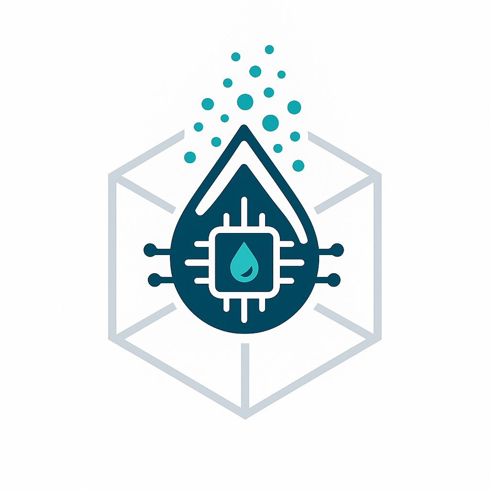
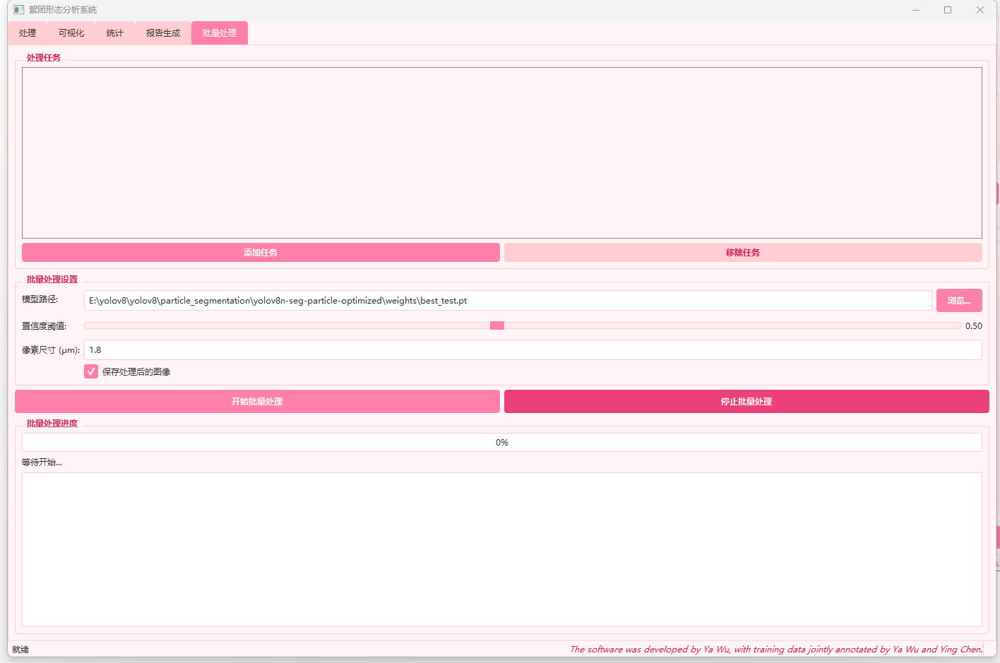
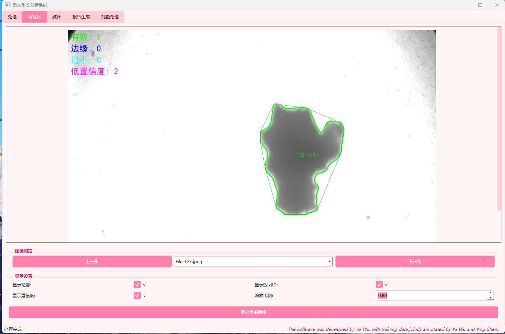

# 🎯 FlocAnalyzer - 絮团检测与分析系统

<p align="center">
  
</p>

<p align="center">
  <b>基于 YOLOv8 + PyQt5 的絮团图像识别、测量、可视化与报告生成系统</b>  
</p>

<p align="center">
  <a href="https://github.com/wuya521/floc-analysis-system/stargazers"></a>
  <a href="https://github.com/wuya521/floc-analysis-system/blob/main/LICENSE"></a>
  
  
</p>

---

## 📸 系统截图

> 示例界面展示

<p align="center">
  
</p>

-----


<p align="center">  </p>

---

## 🧰 功能特色

- 🔍 使用 YOLOv8 分割模型检测图像中的絮团对象
- 📐 自动计算形态学参数（面积、周长、圆度、等效直径、分形维数等）
- 📊 绘制统计图表（直方图、散点图、箱线图等）
- 🖼 处理图像可视化、标注、导出
- 📄 一键生成图像分析报告（PDF）
- 📁 支持批量任务处理与报告生成
- 🆘 内嵌可视化中文帮助文档

---


## 🎯 目标用户（Target Users）

本项目主要面向以下用户群体：

- **海洋环境科学研究人员**  
  需要对水体中絮团颗粒进行高效、准确的图像识别与形态学分析，以支持海洋污染监测和沉积物研究。

- **环境工程师与技术人员**  
  通过自动化工具辅助处理絮团图像，提升数据处理效率，辅助环境治理决策。

- **计算机视觉与人工智能开发者**  
  希望基于 YOLOv8 深度学习框架，构建或定制图像识别与分析系统的开发者和研究者。

- **高校师生及科研团队**  
  适合用于教学演示、科研实验及课题开发，提供图形化操作界面与多参数分析功能。通过本系统，用户可以快速完成絮团图像检测、形态参数测量及统计分析，极大提升工作效率与研究质量。


## 🚀 快速开始（Quick Start）

### 1. 安装依赖

```bash
pip install -r requirements.txt
```

### 2. 下载 YOLOv8 分割模型

请从 ultralytics 官网或训练得到的模型权重中获取 `.pt` 文件，并放入模型路径。

### 3. 运行主程序

```bash
python main.py
```

---

## 📁 项目结构

```
floc-analysis-system/
├── main.py                # 主程序入口
├── requirements.txt       # Python 依赖库
├── README.md              # 项目说明
├── .gitignore             # Git 忽略规则
├── teaching.html          # 可视化内嵌帮助页面
├── assets/                # 存放模型、截图、图示等
│   └── demo.gif
```

---

## ✅ 已实现功能

- [x] YOLOv8 分割模型接入
- [x] 图像中絮团目标检测
- [x] 多参数形态学指标测量
- [x] 图表分析和交互式统计
- [x] PDF 报告生成
- [x] 批量任务处理
- [x] 可视化中文帮助页面

---

## 📌 TODO（未来功能）

- [ ] 模型训练数据集标注指南
- [ ] 多模型版本切换
- [ ] Mac/Linux 平台自动打包支持
- [ ] CLI 无界面批处理模式
- [ ] 数据导出为 Excel 格式

---

## 📜 License

本项目遵循 [MIT License](LICENSE)。

---

## 🙋‍♀️ 作者与联系方式

> 本项目由 **Ya Wu 开发完成，欢迎引用、交流与合作。

- 📧 邮箱：`wuya@mail2.sysu.edu.cn `
- 🏫 中山大学
- 🤝 合作请联系开源主页或 issue 区留言

---

## 🎓 学术引用（Citation）

如果您在科研工作中使用了本项目或其相关成果，请按以下格式引用：

```bibtex
@misc{Wu2025FlocAnalyzer,
  author       = {Wu, Ya},
  title        = {FlocAnalyzer: A YOLOv8 + PyQt5 Based Floc Detection and Analysis System},
  howpublished = {\url{https://github.com/wuya521/floc-analysis-system}},
  year         = {2025},
  note         = {访问日期：2025年6月21日}
}
```

------

## 🚩 常见问题（FAQ）

**Q1: 这个系统支持哪些图像格式？**  
A: 支持常见的图像格式，如 PNG、JPEG、TIFF 等。

**Q2: 如何获取 YOLOv8 的模型权重？**  
A: 你可以从 [Ultralytics 官网](https://github.com/ultralytics/ultralytics)下载预训练模型，或者使用自己的训练权重。

**Q3: 是否支持批量处理多张图片？**  
A: 是的，系统支持批量图像的检测和分析，并自动生成对应的报告。

**Q4: 系统对硬件环境有什么要求？**  
A: 推荐使用具备 GPU 加速的环境以获得更快的检测速度，但 CPU 也可运行。

**Q5: 如何报告 Bug 或提出功能建议？**  
A: 请在 GitHub 仓库的 Issue 区提交，或通过邮箱联系作者。

**Q6: 是否支持在 Mac 或 Linux 平台运行？**  
A: 当前主要支持 Windows，未来计划完善跨平台支持。

如果你有更多问题，欢迎在 GitHub Issue 区留言，我们会及时回复！

-----

## ❤️ 致谢

感谢以下项目提供基础支持：

- [Ultralytics YOLOv8](https://github.com/ultralytics/ultralytics)
- [PyQt5](https://pypi.org/project/PyQt5/)
- [reportlab](https://www.reportlab.com/)
- [Matplotlib](https://matplotlib.org/)

---

## 👥 参与人员

- **Ya Wu** — 项目主要开发者，负责系统架构设计与核心代码实现  ，算法优化与模型训练支持。
- **Ying Chen** — 实验设计与构建 , 核心絮团训练数据标注与测试支持。
